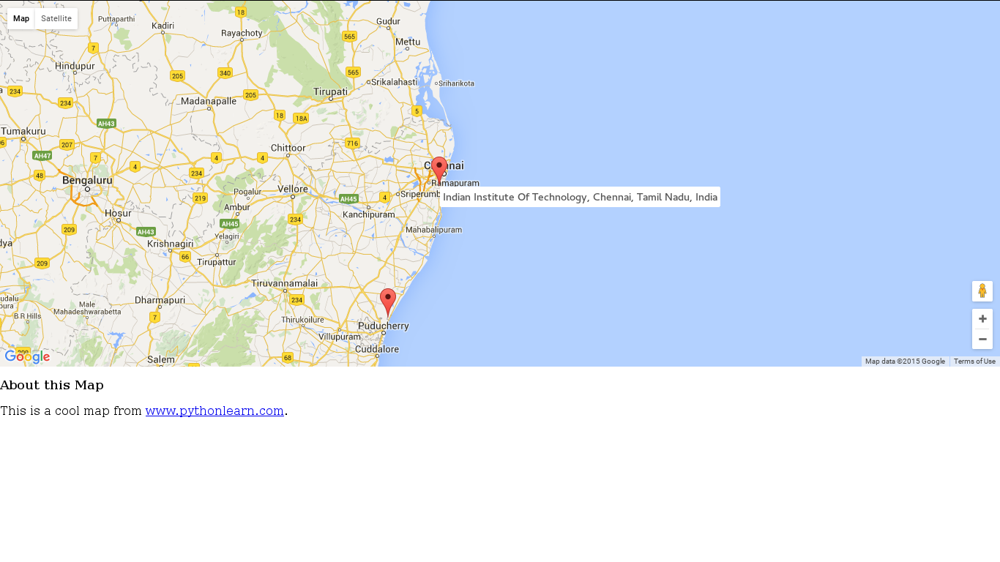
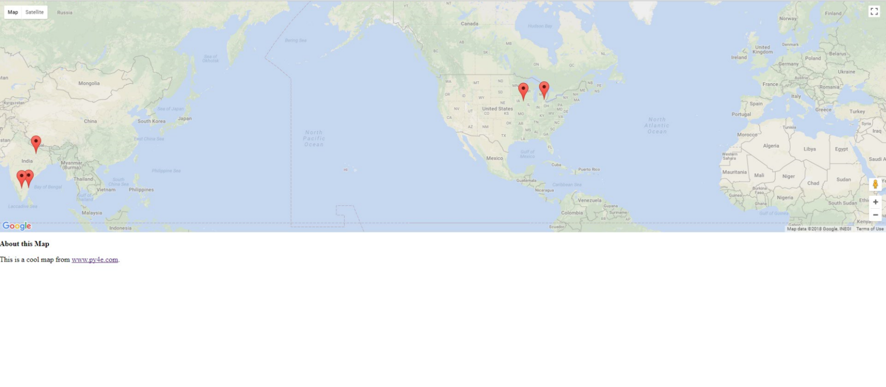

# Geo-Locator
A program that prompts the user for a location, contacts Google Maps API and uses the JSON to display a pin at that location in a browser rendered map made as a part of Python Databases project on Coursera.

Using the Google Places API with a Database and Visualizing Data on Google Maps

In this project, we are using the Google geocoding API to clean up some user-entered geographic locations and then placing the data on a Google Map.

Note: Windows has difficulty in displaying UTF-8 characters in the console so for each command window you open, you may need to type the following command before running this code:

    chcp 65001

http://stackoverflow.com/questions/388490/unicode-characters-in-windows-command-line-how

You should install the SQLite browser to view and modify the databases from:

http://sqlitebrowser.org/

The first problem to solve is that the Google geocoding API is rate limited to a fixed number of requests per day.
So if you have a lot of data you might need to stop and restart the lookup process several times. So we break the problem into two phases.

In the first phase we take our input data in the file (where.data) and read it one line at a time, and retrieve the geocoded response and store it in a database (geodata.sqlite). Before we use the geocoding API, we simply check to see if we already have the data for that particular line of input.

You can re-start the process at any time by removing the file geodata.sqlite

Run the geoload.py program. This program will read the input lines in where.data and for each line check to see if it is already in the database and if we don't have the data for the location, call the geocoding API to retrieve the data and store it in the database.

To use this, simply change the api_key set to your key geoload.py.

If you want to try this with the API key, follow the instructions at:

https://developers.google.com/maps/documentation/geocoding/intro

and put the API key in the code.

The program scans to the point where it finds un-retrieved locations and starts retrieving them.

The geoload.py can be stopped at any time, and there is a counter that you can use to limit the number of calls to the geocoding API for each run.

Once you have some data loaded into geodata.sqlite, you can visualize the data using the (geodump.py) program. This program reads the database and writes tile file (where.js) with the location, latitude, and longitude in the form of executable JavaScript code.

Open where.html to view the data in a browser

The file (where.html) consists of HTML and JavaScript to visualize a Google Map. It reads the most recent data in where.js to get the data to be visualized.

The syntax for JavaScript list constants is very similar to Python so the syntax should be familiar to you.

Simply open where.html in a browser to see the locations. You can hover over each map pin to find the location that the gecoding API returned for the user-entered input.  If you cannot see any data when you open the where.html file, you might want to check the JavaScript or developer console for your browser.

## Sample Log
Here is a sample run after there is already some data in the 
database:

Mac: python geoload.py
Win: geoload.py

Found in database  Northeastern University

Found in database  University of Hong Kong, Illinois Institute of Technology, Bradley University

Found in database  Indian Institute of Technology, Madras, India

Found in database  Vishwakarma Institute, Pune, India

Found in database  UMD

Found in database  Tufts University

Resolving Monash University
Retrieving http://maps.googleapis.com/maps/api/geocode/json?sensor=false&address=Monash+University
Retrieved 2063 characters {    "results" : [  
{u'status': u'OK', u'results': ... }

Resolving Kokshetau Institute of Economics and Management
Retrieving http://maps.googleapis.com/maps/api/geocode/json?sensor=false&address=Kokshetau+Institute+of+Economics+and+Management
Retrieved 1749 characters {    "results" : [  
{u'status': u'OK', u'results': ... }

The first five locations are already in the database and so they 
are skipped.  The program scans to the point where it finds un-retrieved
locations and starts retrieving them.

The geoload.py can be stopped at any time, and there is a counter 
that you can use to limit the number of calls to the geocoding
API for each run.

Once you have some data loaded into geodata.sqlite, you can 
visualize the data using the (geodump.py) program.  This
program reads the database and writes tile file (where.js)
with the location, latitude, and longitude in the form of
executable JavaScript code.   

A run of the geodump.py program is as follows:

Mac: python geodump.py
Win: geodump.py

Northeastern University, 360 Huntington Avenue, Boston, MA 02115, USA 42.3396998 -71.08975
Bradley University, 1501 West Bradley Avenue, Peoria, IL 61625, USA 40.6963857 -89.6160811
...
Technion, Viazman 87, Kesalsaba, 32000, Israel 32.7775 35.0216667
Monash University Clayton Campus, Wellington Road, Clayton VIC 3800, Australia -37.9152113 145.134682
Kokshetau, Kazakhstan 53.2833333 69.3833333
...
12 records written to where.js
Open where.html to view the data in a browser

The file (where.html) consists of HTML and JavaScript to visualize 
a Google Map.  It reads the most recent data in where.js to get 
the data to be visualized.  Here is the format of the where.js file:

myData = [
[42.3396998,-71.08975, 'Northeastern University, 360 Huntington Avenue, Boston, MA 02115, USA'],
[40.6963857,-89.6160811, 'Bradley University, 1501 West Bradley Avenue, Peoria, IL 61625, USA'],
[32.7775,35.0216667, 'Technion, Viazman 87, Kesalsaba, 32000, Israel'],
   ...
];

## Visualization 

  

  

